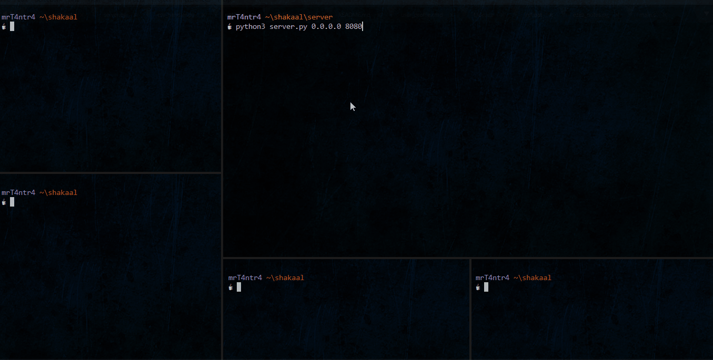
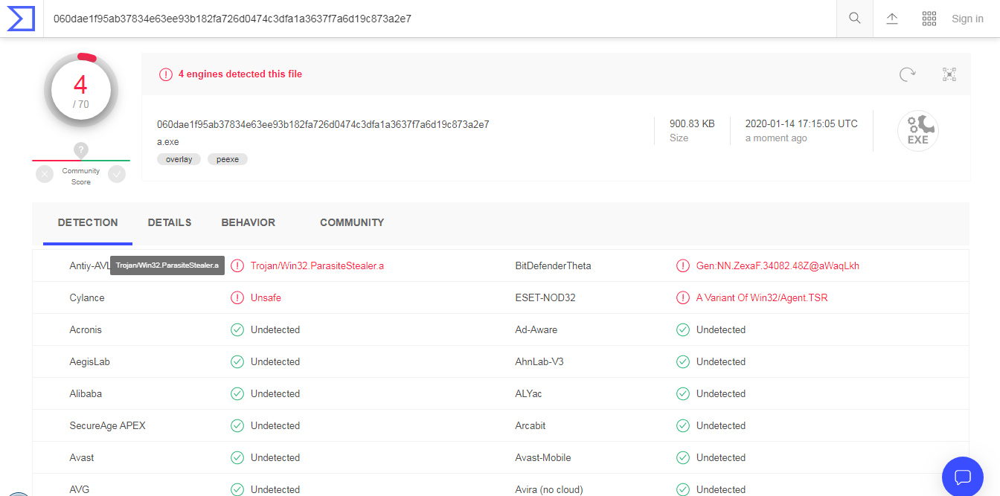

	

<h1 align="center">Shakaal</h1>

:warning: <b>For Educational Purposes Only</b>

***
#### What is Shakaal?
Its a malware I created along with [@sbasu7241](https://github.com/sbasu7241) to get a view from developer's perspective.  

#### Why is it named Shakaal?

Well, I was fond of bollywood movies in my childhood. Shakaal is the bald headed villain from movie Shaan. He was perhaps the first hi-tech villain in Bollywood. He had his own island with sharks and crocodiles. And as he sounded pretty cool to me I decided to give him some tribute XD

***

## In Action

## Features

The bots are controlled with the help of **server.py**.  

We can start a listener by specifing the ip and port:  
`python3 server.py 0.0.0.0 8080`

It is multithreaded and has 3 main thread functions **BotHandler, BotCmd, Pinger**.  
We added some functions such as checking for alive hosts by pinging them continously in another thread.  
The active hosts are saved in the **active_hosts.csv** file while the server is running and is deleted automatically after it stops as there were some inconsistency issues.  

PS: The malware exe size is less than 1 MB.

### List of Commands :  
- whoami
- hostname
- exec
- pwd
- dir/ls
- ps
- chrome
- viewalive
- exit

This set of commands are executed on all the bots currently connected to the server.  
All commands are defined in **cmd.c** file. You can also add some by yourself.  

**- whoami**  
Gets current username from the bot machine.  

**- hostname**  
Gets the Hostname.  

**- exec**  
executes a file but it is most likely to send the output to stdout so it doesn't work perfectly.  
Also We found out that exec is detected by windows but we decided to keep it as is helpful sometimes.  

**- pwd**  
Prints the current working directory  

**- dir/ls**  
Gets list of files/folders in current folder along with their sizes.   

**- ps**  
Gets a list of all processes.   

**- chrome**  
There is a spyware feature too.   
We used sqlite to execute queries on the LoginData db stored locally on bots.  
We also implemented `CryptUnprotectData` from `Win32Crypt.h` along to decrypt chrome login passwords.
Finally all the details are saved on our server machine.
PS: It can fail sometimes if chrome is running on the bot machine as DB gets locked. We could've created a tmp file too but it would've not been stealthy.  

**- viewalive**  
Active Bots are updated in the csv file and we can also view them by the `viewalive` command.   

### Binder  

Coming Soon :)

***
## Requirements & Compilation

For `server.py` just install modules from requirements.txt  
`pip install -r requirements.txt`

FYI `server.py` uses python3.

For compiling the main program the four libraries required are :  
- Libwsock32 
- Libcrypt32
- Libpthread
- Libpsapi 

PS: Its mandatory to include `sqlite.h`.  

Finally we can get a static executable with :  
`gcc cmd.c sqlite3.c main.c -lwsock32 -lcrypt32 -lpthread -lpsapi -static`  
Additionally we can strip out symbols with the `-s` flag in the above cmd.  

***

## VirusTotal Results

I know I shouldn't have uploaded it but I was just curious.  
At last VirusTotal reported only 4 AV engines were able to detect it as a malware.  
And most importantly most used AV softwares such as Avast, AVG, Avira, McAfee, Kaspersky, etc.

[View Detection Results](https://www.virustotal.com/gui/file/060dae1f95ab37834e63ee93b182fa726d0474c3dfa1a3637f7a6d19c873a2e7/detection)  

***
## Credits

This project is based on [this](https://niiconsulting.com/checkmate/2018/02/malware-development-welcome-dark-side-part-1/) blogpost.   
So the credits goes to the original author of the post.  
